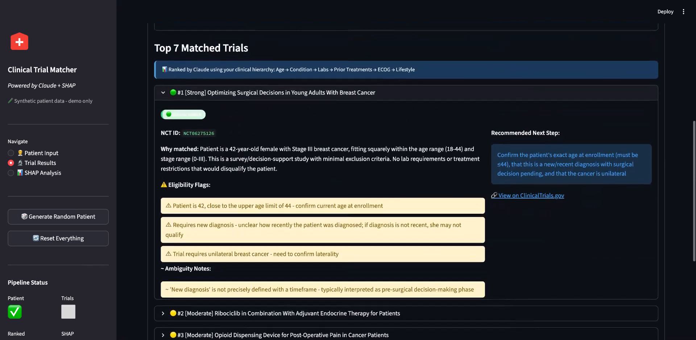

# Clinical Trial Matching Agent

An LLM agent that screens a patient profile against live clinical trials from ClinicalTrials.gov, ranks the matches, flags every borderline eligibility criterion a human needs to verify, and explains each score with SHAP.

**It ranks candidates for a clinician. It does not enroll anyone.**

> Synthetic patient data only. No real patient information is used anywhere in this project. Not for clinical decision-making.



---

## The problem

Roughly 80% of clinical trials miss their enrollment deadline ([Brøgger-Mikkelsen et al., JMIR 2020](https://www.ncbi.nlm.nih.gov/pmc/articles/PMC7673977/)), while research coordinators screen candidates by reading eligibility criteria one PDF at a time. Criteria are written in clinical prose, thresholds are often left unstated, and a single missed exclusion wastes a screening slot.

NIH researchers showed an LLM can help: their TrialGPT system reached 87.3% criterion-level accuracy against 88.7–90% for physicians, and cut screening time 42.6% ([Jin et al., *Nature Communications*, 2024](https://pubmed.ncbi.nlm.nih.gov/37576126/)).

This project is an independent implementation of that idea, with an explainability layer bolted on so a clinician can audit every recommendation.

## How it works

```
Patient profile (3-tier clinical hierarchy)
        ↓
ClinicalTrials.gov API v2 → top 20 recruiting trials
        ↓
Deterministic scorer → 0–100 match score per trial
        ↓
Claude agent → eligibility reasoning, ambiguity handling, ranking (structured JSON)
        ↓
SHAP (KernelExplainer) → why each trial scored what it did
        ↓
Streamlit UI → ranked list, flags, next steps
```

### Two brains, on purpose

**Brain 1 — the LLM.** Reads messy eligibility text, applies a clinical hierarchy supplied in the system prompt (hard filters → lab validators → ranking factors), states its assumptions out loud when criteria are vague, and returns structured JSON with `rank`, `why_matched`, `eligibility_flags`, `ambiguity_notes`, and `recommended_next_step`.

**Brain 2 — a six-feature weighted scorer.** Age fit 25, condition match 25, labs 20, prior treatments 15, ECOG 8, no exclusions 7. Deliberately boring.

Why both? SHAP needs a numeric function to decompose, and an LLM's judgment isn't one. The scorer gives SHAP something honest to explain; the LLM supplies the nuance a weighted sum can't. The LLM handles ambiguity, the scorer handles accountability.

### Design decisions

- **No vector database.** Twenty trials fit in context. Retrieval is the API's job.
- **No fine-tuning.** Zero-shot with an explicit hierarchy in the prompt beat anything trainable on synthetic data.
- **Structured output or nothing.** If the JSON doesn't parse, the UI shows nothing rather than a guess.
- **Agent output is validated against the retrieved candidate list.** See [Limitations](#limitations) — this exists because of a real bug.

## Quickstart

```bash
git clone https://github.com/PHzeek/clinical-trial-agent.git
cd clinical-trial-agent
python -m venv .venv && source .venv/bin/activate
pip install -r requirements.txt

cp .env.example .env        # then add your key
export ANTHROPIC_API_KEY=sk-ant-...

python -m streamlit run app.py        # UI at localhost:8501
python main.py              # or run headless against a synthetic cohort
```

Requires Python 3.10+ and an Anthropic API key. The ClinicalTrials.gov API needs no key.

## Project structure

```
app.py                  Streamlit UI — patient input, results, SHAP tabs
main.py                 Headless pipeline for a synthetic cohort
agent.py                Claude reasoning layer + system prompt
scorer.py               Deterministic 6-feature scoring function
explainer.py            SHAP KernelExplainer + waterfall/summary charts
trials_api.py           ClinicalTrials.gov API v2 client
synthetic_patients.py   Synthetic patient generator
requirements.txt
```

## Limitations

This is a prototype. A prototype proves possibility; production proves value. Here is the gap, stated plainly.

1. **Condition matching is keyword overlap.** Fast and transparent, blind to synonyms. The LLM catches what the scorer misses, but the SHAP chart doesn't know that.
2. **Lab thresholds are defaults, not the protocol's.** eGFR ≥ 30, creatinine ≤ 1.5. If a trial specifies otherwise, the scorer is wrong and confident. The agent flags the ambiguity; the number doesn't.
3. **Retrieval is capped at 20 trials.** Good for latency and cost, bad if the right trial is #21. Real screening needs a retrieval stage with recall@k, not a page size.
4. **There is no evaluation harness.** The TrialGPT team hand-labeled 1,015 patient-criterion pairs with three physicians before claiming 87.3% accuracy. I have synthetic patients and my own judgment. I can't state my numbers yet, and I won't pretend otherwise.
5. **Positive predictive value is the metric that matters.** A 2026 TrialGPT deployment at UT Health San Antonio reported 75% PPV — one in four flagged patients wasn't actually eligible ([PubMed](https://pubmed.ncbi.nlm.nih.gov/41637159/)). That is why this ranks candidates for a human and never enrolls anyone.

### A bug worth documenting

An earlier build had the agent returning NCT IDs that weren't in the candidate list retrieved from the API — plausible-looking trial IDs the model produced on its own. It surfaced only because the SHAP layer looks trials up by ID rather than by position, so it refused to explain rows it couldn't find.

The fix is two-part and both halves are in `agent.py`: the system prompt constrains output to the supplied list, and the parsed response is filtered against the retrieved set before anything renders. The UI now reports "all verified against the retrieved list" when the check passes.

Worth stating because it's the kind of failure that ships silently in an LLM system, and the thing that caught it was a design choice, not luck.

## Roadmap

Before this belongs anywhere near a clinic:

- [ ] Gold-labeled evaluation set built with a clinician (~100 patient-criterion pairs)
- [ ] Per-criterion accuracy, precision, and PPV
- [ ] Retrieval recall@20 vs @50
- [ ] JSON parse-failure rate under load
- [ ] Time-per-screen with and without the tool — if this doesn't move, none of the rest matters
- [ ] Containerized FastAPI service for the scorer, with monitoring

## Disclaimer

Research and demonstration project. Synthetic patient data only. Not a medical device, not clinical decision support, not validated for any clinical use. Trial data comes from the public ClinicalTrials.gov API and may be incomplete or out of date.

## License

MIT — see [LICENSE](LICENSE).

---

Built by [Ezekiel Adoh](https://www.linkedin.com/in/ezekieladoh) · [Prolific Analytics](https://www.prolificanalytics.io)
